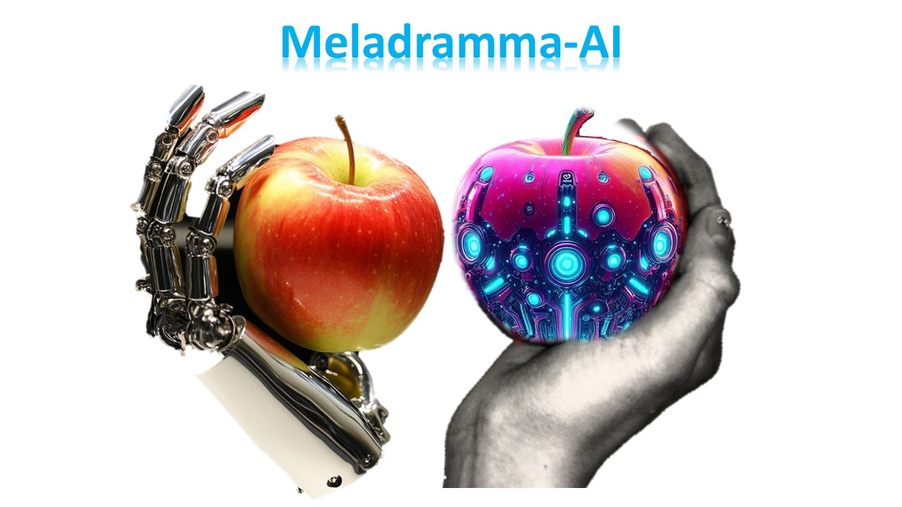

**Meladramma-AI** is a live opera production at Ontario Tech University that
puts generative AI on the operatic stage — I built the AI that made it
possible.

## My role

I was the **sole producer, coder, and manager** of the AI production pipeline.
I worked directly with the **Dean of Information Technology** and the **Faculty
of Arts & Humanities** to integrate AI into the production and elevate the
audience experience — bridging a machine-learning workflow and a live
performance under one hard, public deadline.

## What I built

- **AI vocal textures** — generative models producing unique vocal timbres that
  performers and sound designers could weave into the score.
- **Generated stage visuals** — AI-generated visual elements projected during
  the performance, responding to the production's themes.
- **A production-grade pipeline** — models that had to be reliable,
  art-directable, and fast enough for a live show, not just a notebook demo.

## Why it matters

Most ML coursework ends at a validation metric. This work ended in front of a
live audience — which meant owning the whole thing end to end, from the models
to the moment the lights came up.

[See the official production page ↗](https://businessandit.ontariotechu.ca/fbit-xo/arts-and-humanities/meladramma-ai1.php)
